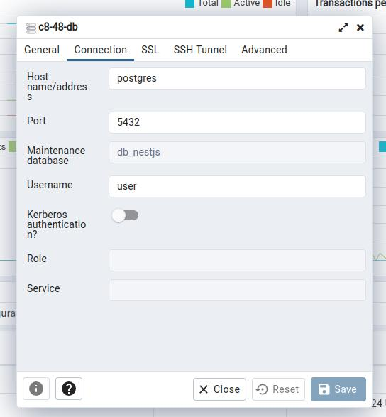

# How to Run PostgreSQL and pgAdmin Using Docker

While working with Postgres is normal that most information about how to solve issues mention the console commands. But
any improvement to development work is welcome, one of it can be to use a visual tool to manage the database. You can
use pgAdmin as an alternate solution if you don’t like managing your database using the command-line interface. It’s a
web-based front-end for the PostgreSQL database server. This project tries to be easy to run using docker and `pgadmin`
in order to make work on Postgres easy and fast.

Database management via a command-line interface can be nerve-racking. To solve this issue, we can use a tool with an
interface. The pgAdmin solves this problem. Moreover, Docker makes the entire process smoother.

## Main features

- Configurable SQL shell

- Customizable syntax highlighting

- SQL keywords, and SQL comments

- Easily create, edit, and delete Postgres databases

- Autocompletion for SQL and PostgreSQL symbols

- Easily migrate Postgres database to another Postgres database

- SQL history

- Works with Postgres versions 10 and above

- Automatically reload Postgres database when a change is made

- Docker deployment

- Docker-compose deployment

## Setup

1. Make sure you have docker installed and running.
   First of all, follow the instructions in the following steps to setup Postgres with Docker:

We will use a Docker compose file for our first method, and we need to put the docker-compose.yml inside a folder. In
this case, the name of the folder is pgAdmin. Let’s break down the individual ingredients of the
docker-compose.yml file.

Now run the following command from the same directory where the docker-compose.yml file is located.

```sh
docker-compose up pgadmin
```

The command docker compose up starts and runs the entire app. Congratulations!, you are successfully running a
PostgreSQL database and pgadmin4 on your machine using Docker. Now let’s connect pgadmin4 to our PostgreSQL
database server.

First, access the pgadmin4 via your favorite web browser by vising the URL http://localhost:5050/. Use the
admin@admin.com for the email address and `password` as the password to log in.

Click Servers > Create > Server to create a new server. Select the General tab. For the name field, use any name. In
this case, I’ll use `c8-48`. Now move to the Connection tab. To get the value for of Host, use the name of
container name. So our current configuration would be the following.



You can find the PostgreSQL database server’s container name using the docker ps command and grab the name from
the NAMES column.

You can connect a pgAdmin docker container to a running PostgreSQL container. It is helpful when you don’t have a
pgAdmin service in your docker-compose.yml file.
